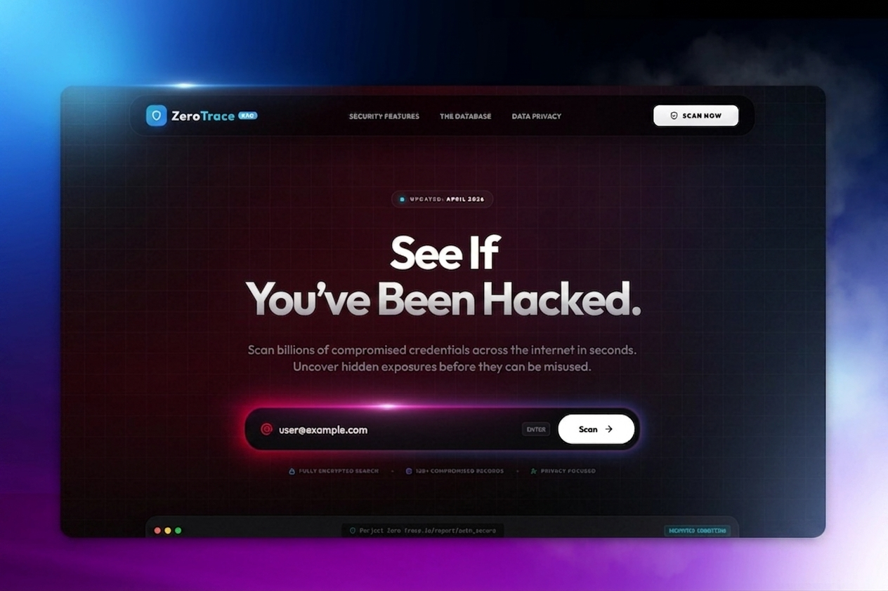

# 🛡️ Project Zero Trace: See If You’ve Been Hacked

### **"Scan billions of compromised credentials across the internet in seconds. Uncover hidden exposures before they can be misused."**

[**RUN THE PROJECT ZERO TRACE SCAN NOW**](https://zorexeye.com/zerotrace/)

---

## 🕵️ Are You Exposed?
Your digital identity is a target. Every day, thousands of accounts are compromised in silent data breaches. **Project Zero Trace** is designed to reveal what hackers already know about you. 

Don't wait for a login notification from a stranger. Use **Project Zero Trace** to look behind the curtain of the dark web and see if your private information is sitting in a public database.

---

## ⚡ Why Project Zero Trace?

**Project Zero Trace** isn't just a search engine; it’s an **Institutional Intelligence** tool scaled for the everyday user. 

*   **Instant Exposure Detection:** **Project Zero Trace** scans billions of compromised credentials in the blink of an eye.
*   **Stop the Threat:** Find out exactly which of your passwords or emails are floating around the internet before they are used against you.
*   **The Power of Seconds:** While other tools take minutes, **Project Zero Trace** delivers results in seconds.

---

## 🔍 How Project Zero Trace Protects You

### **Search. Uncover. Secure.**
1.  **Enter your data:** Put your email or username into the **Project Zero Trace** interface.
2.  **Scan billions of records:** Our high-speed engine searches through historical and live data breaches instantly.
3.  **Identify the Leak:** **Project Zero Trace** shows you if you've been hacked, allowing you to change your passwords before it's too late.

---

## 🛠️ The Tech Behind Project Zero Trace
Built for professionals, designed for you. **Project Zero Trace** uses a high-end "SaaS Premium" architecture to ensure zero-overhead and maximum speed:
*   **Ultra-Fast Scanning:** Powered by an optimized SQLite and PHP backend.
*   **Premium Security UI:** A professional, dark-mode glassmorphism interface.
*   **Massive Intelligence:** **Project Zero Trace** is built on a custom algorithm designed to find what others miss.

---

## 🏷️ Search Engine Optimization (SEO) Metadata
*To help you find Project Zero Trace online, we target these high-traffic keywords:*

**Primary Key:** Project Zero Trace
**Search Tags:** Have I been hacked?, Project Zero Trace Data Breach, Credential Leak Scanner, Project Zero Trace OSINT, Password Exposure Check, ZorexEye Project Zero Trace, Digital Privacy Tool, Instant Breach Search.

---

## 📜 Ethical Use & Disclaimer
**Project Zero Trace** is a tool for security awareness and personal protection. We believe everyone has the right to know if their data is at risk. Use **Project Zero Trace** to audit your own security and stay one step ahead of digital threats.

---

**Official Link:** [https://zorexeye.com/zerotrace/](https://zorexeye.com/zerotrace/)
**Developer:** [Kazi Firoz Asif](https://kazifiroz.pages.dev/)
**Brand:** Project Zero Trace by ZorexEye

<!-- Project Zero Trace - The most powerful way to see if you have been hacked. Scan billions of records instantly with Project Zero Trace. -->
